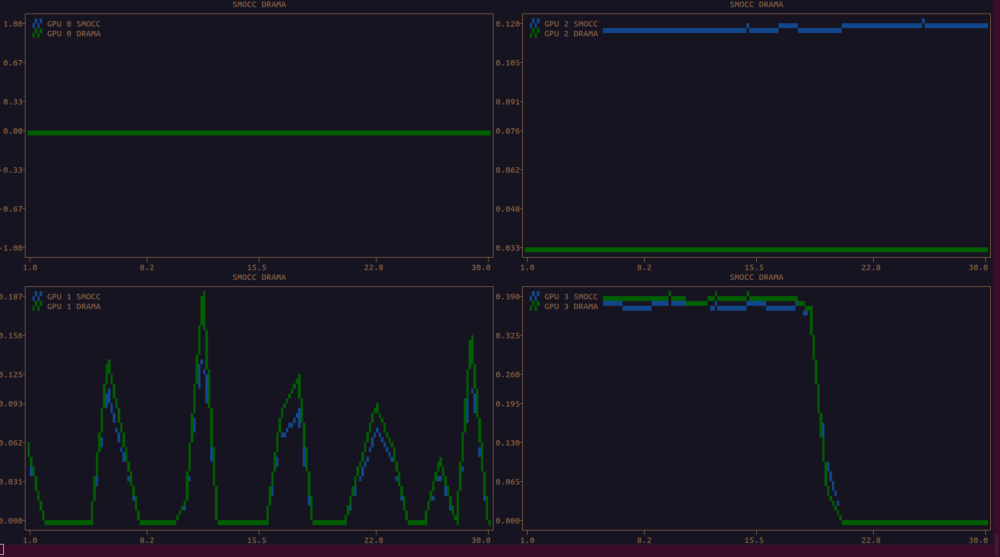

## dcgmi_top

dcgmi display similar to nvtop



## How to run

Set the list of metrics you want as a comma separated string. 
Set the list of gpus you want as a comma separated string.
Set the refresh rate if you want quicker updates.

It might crash randomly if dcgmi throws an exception.

`python dcgmi_top.py --metrics SMOCC,DRAMA  --refresh_rate=1000`

## Help output

```bash
usage: dcgmi_top.py [-h] [--gpus GPUS] [--metrics METRICS] [--refresh_rate REFRESH_RATE]

options:
  -h, --help            show this help message and exit
  --gpus GPUS           Comma-separated gpu id list
  --metrics METRICS     Comma-separated metrics list. Possible values: ['GPUTL', 'MCUTL', 'GRACT', 'SMACT', 'SMOCC', 'TENSO', 'DRAMA', 'PCITX', 'PCIRX', 'NVLTX', 'NVLRX', 'POWER']
  --refresh_rate REFRESH_RATE
                        Refresh rate.
```

## Future

- Fix the aspect ratio being broken for the plotext+curses integration
- Fix random dcgmi errors breaking entire plot
- Fetch max wattage from GPU and set X/Y scale on startup.